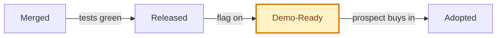

Engineering orgs run two release gates. **Merged**: code is in main, tests green. **Released**: the flag is on for some audience, the feature works end to end.

There's a third, and most teams skip it. Call it **demo-ready**.

The question demo-ready asks is uncomfortable.

> Could a salesperson demo this right now, cold, to a real prospect, without hedging or apologizing?

If the answer is no, the feature isn't done. It's in production, yes. It's released, technically. But it hasn't crossed the gate that matters for adoption.

## The three gates side by side

Each gate answers a different question, has a different owner, and fails in a different way when you skip it.

|  | **Merged** | **Released** | **Demo-Ready** |
|--|------------|--------------|----------------|
| **Question** | Does the code work? | Can customers reach it? | Could a stranger see this cold? |
| **Owner** | Author and reviewers | PM or release manager | Someone with customer proximity |
| **Signal it passed** | Tests green, review approved | Flag on for the audience | Cold demo with no apologies |
| **Cost of skipping** | Broken main | Feature invisible | Feature adopted on paper only |

The first two gates have obvious owners. The third doesn't, so it gets skipped by default.

## Why the gate gets skipped

Engineers optimize for "works". Once the tests pass and the feature behaves correctly on the happy path, they move on. Edge cases that a careful user would notice ("why is the empty state just a blank table?") live on the backlog forever because they don't block anything.

Product managers optimize for scope. If the feature does what the spec said, they mark it done. Polish is a separate ticket someone else owns.

Sales doesn't know what to ask for. They try the feature once, hit a rough edge, file "product feels janky" in a CRM note, and work around it for the rest of the quarter.

No one is accountable for demo-readiness, so no one drives it.

## What "demo-ready" actually means

It isn't subjective. There's a repeatable checklist.

| # | Check | What it rules out |
|---|-------|-------------------|
| 1 | Happy path runs in under thirty seconds | Prospect attention drift |
| 2 | Empty state is designed, not default | "This looks unfinished" |
| 3 | Error state is graceful | Catastrophic failure mid-demo |
| 4 | Seed data is plausible | "They don't sweat the details" |
| 5 | Performance is predictable | Demoer surprised mid-sentence |
| 6 | Every visible UI element works | "Ignore that button" moments |
| 7 | Copy reads naturally at a glance | Confused questions about labels |

A few of these deserve a sentence each.

**Performance predictable, not fast.** It doesn't have to be a flash. It has to be the same speed every time, so the person narrating can plan around the wait instead of getting caught mid-sentence by a spinner that hung for thirty seconds instead of three.

**Plausible seed data.** Accounts named "test1", "asdfasdf", or "Lorem Ipsum Corp" tell the prospect that your team doesn't think about details. It's a cheap fix and a large signal.

**Visible but broken is worse than invisible.** Feature-flag out the half-finished buttons and dropdowns. "Ignore that, it's coming next sprint" ends the demo for the audience even if the demoer recovers.

A feature passes the gate when all seven rows are green.

The checklist holds outside a traditional sales motion too. For self-serve products, swap "salesperson" for "first-time user". For developer tools, swap "demo" for "README walkthrough". Wherever a stranger encounters your product without context and forms an opinion in the first thirty seconds, the same gate applies.

## Who owns the gate

Not the engineer who built it. They're too close. They'll look at a stack trace and see the fix. A prospect looks at a stack trace and sees a red flag.

Not the PM who scoped it. They'll be tempted to say "good enough for now" because the backlog is long.

The owner should be someone with customer proximity and no personal investment in the build. In a company with a sales motion, that's a sales engineer, a product marketer, or a PM who runs demos. Their job is to attempt a cold demo on a clean account and report back with the list of things they'd apologize for.

That list is the gate. When the list is empty, the feature is demo-ready.

## How to build it into your release flow

Make it a ticket. Not a "polish" ticket. A distinct status in your workflow, sitting between "released to early customers" and "listed as generally available". Call it whatever makes sense: demo-ready, GA-ready, launch-ready. The name matters less than the fact that it's a status, not an opinion.

The ticket closes when a demo happens. Someone opens a clean demo account, walks through the flow as a prospect would, and files no bugs. That's the signal.

Some teams bake the gate into a demo day. Once a week, once a month, whatever the cadence, features that claim to be demo-ready get demoed. Bugs surface. Embarrassments surface. The gate works because it's public and external. The engineer can't grade their own feature.

## What happens when you skip the gate

A predictable sequence.

Sales tries the feature once, hits a rough edge, and avoids demoing it for the rest of the quarter. The feature's telemetry looks worse than expected because prospects never saw it. Someone in a QBR asks why the big feature from Q1 didn't move the number. The team concludes the feature didn't land.

Six months later, you ship a "V2" that's actually the demo-ready version of V1. You spend the polish budget you should have spent before the flag was ever flipped on.

The prospects who saw V1 don't come back. You lost the compounding effect of the original release, and you paid for two launches to ship one demoable feature.

## A simpler frame

Released is the state the software is in. Demo-ready is the state a human is in when they decide whether to show your product to another human. Those are not the same state, and teams that treat them as the same find out the hard way.

The third gate is cheap to add and expensive to skip. Add it.
