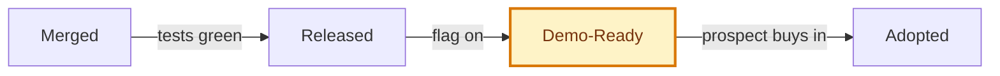

Most engineering orgs have two release gates. Merged: the code is in main and the tests are green. Released: the flag is on for some audience and the feature works end to end.

There's a third one that most teams skip, and I've started calling it demo-ready.

```mermaid
flowchart LR
    M[Merged] -->|tests green| R[Released]
    R -->|flag on| D[Demo-Ready]
    D -->|prospect buys in| A[Adopted]

    classDef skipped fill:#fef3c7,stroke:#d97706,stroke-width:2.5px,color:#78350f;
    class D skipped;
```

The question it asks is uncomfortable: could a salesperson demo this right now, cold, to a real prospect, without hedging or apologizing?

If the answer is no, the feature isn't done. It's in production, it's technically released, but it hasn't crossed the gate that decides whether anyone adopts it.

## The three gates

Each one answers a different question, has a different owner, and fails in a different way when you skip it.

Merged asks whether the code works. The author and the reviewers own it. You know it passed when tests are green and the review is approved. Skip it and you break main.

Released asks whether customers can reach it. A PM or a release manager owns it. You know it passed when the flag is on for the intended audience. Skip it and the feature is invisible.

Demo-ready asks whether a stranger could see this cold and not be put off. It should be owned by someone close to customers. You know it passed when someone did a cold demo with nothing to apologize for. Skip it and the feature is adopted on paper only.

The first two have obvious owners. The third doesn't, so by default nobody drives it.

## Why it gets skipped

Engineers optimize for "works". Once the tests pass and the happy path behaves, they move on. The things a careful user would notice ("why is the empty state a blank table?") sit in the backlog forever, because they don't block anything.

Product managers optimize for scope. If the feature does what the spec said, it's done. Polish is a separate ticket that someone else owns.

Sales doesn't know what to ask for. They try the feature once, hit a rough edge, write "product feels a bit janky" in a CRM note, and work around it for the rest of the quarter.

Nobody is accountable for demo-readiness, so nobody does it.

## What demo-ready means in practice

It's less subjective than it sounds. The list I use:

1. The happy path runs in under thirty seconds. Any longer and the prospect's attention drifts.
2. The empty state is designed, not the default. A blank table reads as unfinished.
3. Errors fail gracefully. A stack trace mid-demo ends the demo.
4. The seed data is plausible. Accounts named "test1", "asdfasdf", or "Lorem Ipsum Corp" tell the prospect you don't sweat details. It's a cheap fix and a loud signal.
5. Performance is predictable. Not necessarily fast, but the same every time, so the person narrating can plan around the wait instead of being surprised by a spinner that took thirty seconds instead of three.
6. Every visible element works. Feature-flag out the half-finished buttons. "Ignore that, it's coming next sprint" ends the demo for the audience even if the demoer recovers.
7. The copy reads naturally. Labels shouldn't generate questions.

When all seven hold, the feature is demo-ready.

The same list works outside a sales motion. For self-serve products, replace "salesperson" with "first-time user". For developer tools, replace "demo" with "README walkthrough". Wherever a stranger meets your product with no context and forms an opinion in the first thirty seconds, this gate applies.

## Who owns it

Not the engineer who built it. They're too close. They look at a stack trace and see the fix. A prospect looks at a stack trace and sees a red flag.

Not the PM who scoped it either. The backlog is long and "good enough for now" is tempting.

It should be someone with customer proximity and no stake in the build. In a company with a sales motion, that's a sales engineer, a product marketer, or a PM who runs demos. Their job is to attempt a cold demo on a clean account and come back with the list of things they'd apologize for. That list is the gate. When it's empty, you're through.

## Putting it in the release flow

Make it a status, not an opinion. A distinct step in the workflow between "released to early customers" and "generally available". Call it demo-ready, GA-ready, launch-ready, whatever fits. The name matters less than the fact that a ticket sits in it.

The ticket closes when a demo happens. Someone opens a clean account, walks through the flow as a prospect would, and files no bugs.

Some teams attach the gate to a demo day. Weekly, monthly, whatever cadence fits, and every feature that claims to be demo-ready gets demoed. Bugs surface. Embarrassments surface. It works because it's public and external. The engineer can't grade their own feature.

## What happens without it

The sequence is predictable. Sales tries the feature once, hits a rough edge, and avoids showing it for the rest of the quarter. The feature's usage numbers look worse than expected because prospects never saw it. Somebody asks in a quarterly review why the big Q1 feature didn't move the number. The team concludes the feature didn't land.

Six months later you ship a "V2" that is really the demo-ready version of V1. You spend the polish budget you should have spent before the flag was flipped, and the prospects who saw V1 don't come back. Two launches to ship one demoable feature.

## A simpler way to put it

Released is a state the software is in. Demo-ready is a state a human is in when they decide whether to show your product to another human. They're different states, and teams that treat them as the same one find out the hard way.

The third gate is cheap to add and expensive to skip.
